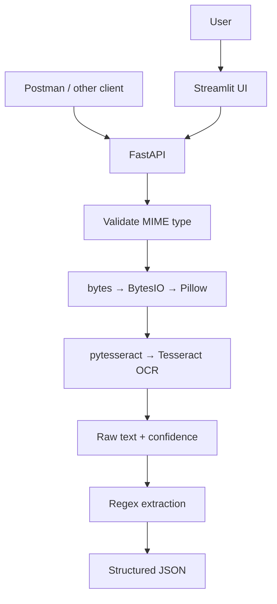

# 🔎 OCR Structured Extraction API

A REST API and web UI that turns uploaded images into **machine-readable text and structured fields**: image → OCR → regex extraction → JSON.

> **Topics:** `ocr` `tesseract` `fastapi` `streamlit` `regex` `document-processing` `python`

---

## Architecture



**Division of labour:** Tesseract performs OCR · pytesseract is the Python interface · Pillow handles the image · regex finds patterns · FastAPI exposes the service · Streamlit is the UI.

## Endpoints

| Method | Path | Purpose |
|---|---|---|
| GET | `/` | Service info |
| GET | `/health` | Checks the Tesseract dependency is reachable |
| POST | `/ocr` | Returns raw extracted text |
| POST | `/ocr/structured` | Returns text + extracted emails, phones, dates, URLs, currency amounts, and lines |

Interactive docs are served automatically at `/docs` (Swagger UI).

### Example *(illustrative: replace with real output)*
```bash
curl -X POST http://localhost:8000/ocr/structured -F "file=@sample.png"
```
```json
{
  "text": "Name: Mia\nEmail: mia@example.com\nPhone: 9876543210",
  "confidence": 91.4,
  "fields": {
    "emails": ["mia@example.com"],
    "phones": ["9876543210"]
  }
}
```

## Engineering notes
- Uploads are validated by MIME type before processing.
- Files are processed **in memory** (`BytesIO`); nothing is written to disk.
- **Confidence scoring:** uses `pytesseract.image_to_data()` (not just `image_to_string()`) to get per-word confidences, filters invalid values, and averages the rest, so every response can state how reliable the OCR is.
- OCR is decoupled from the UI, so the same backend serves Streamlit, Postman, or any client.

## Run locally *(verify against your files)*
```bash
# 1. Install the Tesseract OCR engine (system package)
# 2. Install Python dependencies
pip install -r requirements_with_streamlit.txt
# 3. Start the API
uvicorn main:app --reload
# 4. Start the UI
streamlit run streamlit_app.py
```
See `STREAMLIT_GUIDE.md` for UI details.

## My contribution
>  Built a FastAPI-based OCR service using Tesseract and Pillow to process document images and extract text through API endpoints. Implemented the backend workflow to make document text accessible for downstream processing.

## Limitations
- Regex finds *patterns*, not meaning; unusual formats can be missed.
- OCR quality depends on image quality (resolution, skew, lighting).
- Next: image pre-processing, layout-aware extraction, field-level confidence.

## Tech stack
Python · FastAPI · Tesseract · pytesseract · Pillow · regex · Streamlit · Swagger UI · Postman
